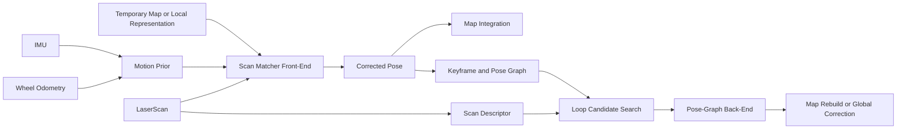

# ROS SLAM Mapper

ROS 2 Humble based standalone SLAM mapping line derived from the lessons learned in `amr_slam_mapper`.

Current `0.1.0` direction:
- keep the scope at `amr_slam_mapper` follow-up level first
- use `/slam/*` topic names instead of the old `/amr/*`
- split the migrated mapper into dedicated packages
  - `slam_scan_matcher`: scan-matcher utility package and node
  - `slam_pgraph_server`: current runtime node and pose-graph back-end
  - `slam_submap_server`: temporary map accumulation utility package and node
  - `slam_mapper`: metapackage only
- keep changes narrow, testable, and conservative around loop closure

## Purpose

This repository exists to separate SLAM mapping work from the broader AMR navigation stack.

The first goal is not a full navigation product.
The first goal is to build a clean SLAM-focused workspace that can:
- follow up on the current `amr_slam_mapper` quality level
- preserve the good parts of the recent mapping improvements
- iterate on front-end / back-end SLAM quality without dragging AMR contracts along

## Working Rules

Every meaningful task in this repository should be grounded in:
- `README.md`
- `TODO.md`
- `CHANGELOG.rst`
- `coding_template.txt`

This means:
- update `README.md` when architecture, interfaces, or workflow meaningfully change
- update `TODO.md` when priorities or experiment tracks change
- update `CHANGELOG.rst` when a new branch starts or a meaningful milestone lands
- follow `coding_template.txt` for code style and file-organization expectations

## Initial Topic Direction

The standalone SLAM line should use `/slam/*` names by default.

Examples:
- `/slam/map/temp/raw`
- `/slam/map/temp/refined`
- `/slam/map/temp`
- `/slam/mapper/odometry`
- `/slam/mapper/pose`
- `/slam/mapper/graph_debug`

## Architecture Direction



## Initial Scope

Near-term focus:
- stabilize the standalone SLAM mapper package baseline
- clarify front-end vs back-end responsibilities
- preserve conservative loop acceptance
- improve large-loop return behavior without reintroducing false loop closures

Out of scope for the first line:
- broad AMR topic compatibility
- MQTT / viz / fleet contracts
- forced `slam_toolbox` replacement work
- full navigation integration

## Planned Repository Shape

Current active packages:
- `slam_bringup`
- `slam_mapper`
- `slam_scan_matcher`
- `slam_pgraph_server`
- `slam_submap_server`

## Launch

```bash
ros2 launch slam_bringup slam.launch.py
```

With TurtleBot3 robot bringup included first:

```bash
ros2 launch slam_bringup slam.launch.py robot_bringup:=true
```

Notes:
- default is `robot_bringup:=false`
- when `true`, `turtlebot3_bringup/launch/robot.launch.py` is included before the SLAM lifecycle nodes
- when `false`, `/odom`, `/imu`, and `/scan` are expected to already be available from an external bringup

## Build Intent

When package scaffolding lands, the repo should stay buildable with standard ROS 2 Humble `colcon build` flows.
