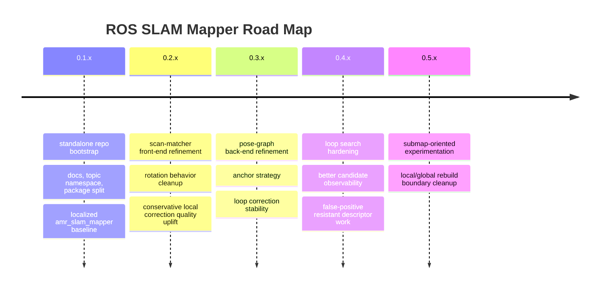

# ROAD MAP

## Product Direction

This project is building toward a standalone SLAM mapping line with:
- a pure mapping-first runtime
- explicit front-end and back-end separation
- conservative loop closure behavior
- enough observability to compare scan matching, keyframe, and optimizer changes cleanly

## 0.1.x Goal

- start from `amr_slam_mapper` follow-up quality, not from a blank algorithm experiment
- separate the work from `ros-amr-navigation` contracts and `/amr/*` topic ownership
- establish repository rules around `README.md`, `TODO.md`, `CHANGELOG.rst`, and `coding_template.txt`
- finish stabilizing the localized package split on `/slam/*`

## Immediate Focus

### 1. Standalone Baseline Bootstrap

- define the standalone repository contract
- document `/slam/*` topic names
- keep `slam_mapper` as a pure metapackage
- keep `slam_scan_matcher`, `slam_pgraph_server`, and `slam_submap_server` as actual node-owning packages
- keep the first branch small and auditable

### 2. Scan Matcher Front-End

- preserve the good lessons from `amr_slam_mapper`
  - limited IMU heading usage
  - conservative local correction caps
  - rotation-heavy segment handling
- keep a karto-family front-end mindset
  - motion prior plus local scan alignment
  - geometry-aware matching improvement over time
- pass criteria
  - straight segments stay stable
  - large turns do not immediately bend the local map
  - correction jumps remain explainable
- fail criteria
  - front-end becomes harder to reason about
  - straight-line quality regresses
  - loop quality only looks better because false constraints were accepted

### 3. Pose-Graph Back-End

- keep a pose-graph optimizer mindset
  - keyframes
  - odom edges
  - conservative loop edges
  - graph-based map rebuild
- investigate the current large-loop return weakness
  - `+Y` tilt after returning to the old corridor line
  - global heading stabilization weakness
  - anchor / weight / correction-step issues
- pass criteria
  - loop return aligns better with the original straight axis
  - accepted loop closures do not tip the whole map
- fail criteria
  - loop closes but the global line still leans
  - optimizer tears or over-rotates the map

### 4. Loop Search Policy

- avoid aggressive rotation-invariant matching until stronger anti-false-loop guards exist
- improve observability before improving aggressiveness
- compare:
  - descriptor distance
  - local rescore
  - accepted loop count
  - graph correction magnitude

### 5. Submap Boundary Exploration

- keep this as a later track, not the first implementation target
- use it only when front-end / optimizer responsibilities become clearer

## Experiment Rules

- change one axis at a time
- use the same driving pattern for comparison
  - straight
  - large turn to form loop
  - return to the original corridor or line
- judge changes by:
  - corrected pose stability
  - map axis preservation
  - loop acceptance timing
  - false loop avoidance
  - rebuild consistency
