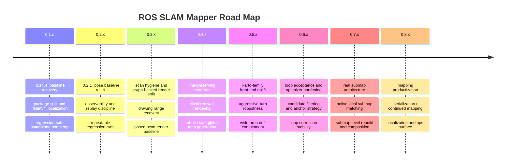
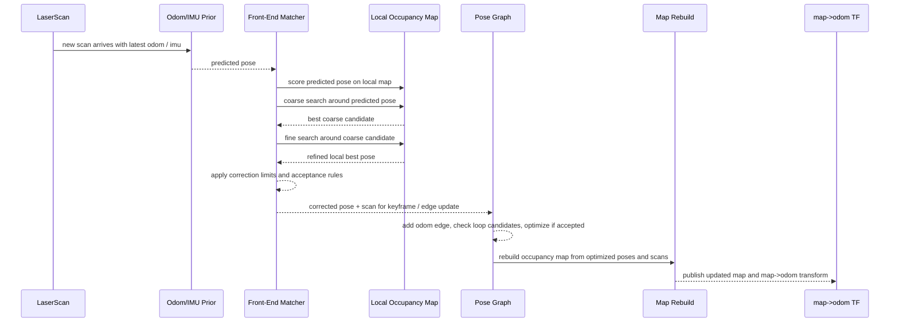

# ROAD MAP

## Product Direction

This project is building toward a standalone SLAM mapping line with:
- a pure mapping-first runtime
- explicit front-end and back-end separation
- conservative loop closure behavior
- enough observability to compare scan matching, keyframe, optimizer, and rebuild changes cleanly
- a long-term architecture that can follow the stronger ideas in `slam_toolbox` without losing the simpler `amr_slam_mapper` baseline
- a concrete quality target of:
  - `0.2.1`-level pose quality
  - `slam_toolbox`-like wall continuity, line exactness, and drawing range

## 0.1.x Goal

- start from `amr_slam_mapper` follow-up quality, not from a blank algorithm experiment
- separate the work from `ros-amr-navigation` contracts and `/amr/*` topic ownership
- establish repository rules around `README.md`, `TODO.md`, `CHANGELOG.rst`, and `coding_template.txt`
- finish stabilizing the localized package split on `/slam/*`
- after `amr_slam_mapper` copy, run-up test after launch and topic-name replacement
- split `slam_mapper` package R&R cleanly

## Immediate Focus

### 1. `0.14.4` Baseline Lock

- keep `amr_slam_mapper` `0.14.4` behavior as the reference line
- allow only:
  - package modularization
  - `/amr/*` to `/slam/*` topic localization
  - bringup / parameter ownership cleanup
- reject accidental algorithm changes before they are explicitly planned
- keep a replayable regression route for:
  - straight corridor
  - one-loop revisit
  - wider left-side excursion

### 2. Observability First

- log and compare:
  - raw odom pose
  - predicted pose
  - corrected pose
  - loop candidate score and accepted edge
  - optimize pre/post displacement
  - rebuild pre/post map retention
- treat runtime noise separately from algorithm issues
- keep enough debug data to explain:
  - loop-triggered `map -> odom` movement
  - rebuild-driven pixel loss
  - wide-area drift accumulation

### 3. `0.2.1` Pose Baseline Reset

- treat `humble/develop/0.2.1` as the current localization / pose-estimation baseline
- current observation:
  - pose estimation looks visually and operationally strong
  - map rendering quality is still much worse than `slam_toolbox`
  - therefore the next refactor target is not pose estimation first, but map integration / map rendering
- discard `0.2.2` as a performance reference for SLAM quality
- only keep `0.2.2` launch convenience changes if they are operationally useful
- pass criteria
  - all future comparisons start from the `0.2.1` pose behavior
  - map-quality work does not degrade the existing pose baseline

### 4. Map Representation / Rendering Reset

- current status:
  - `0.2.1` remains the pose / localization baseline
  - `0.3.0` introduced a graph-backed render path and a dedicated filtered scan contract
  - line formation, drawing range, and revisit clustering are still clearly behind `slam_toolbox`
- first quality gate:
  - stabilize scan cleanliness before deeper rendering changes
  - introduce a dedicated filtered scan path instead of mutating `/scan` directly
  - prefer `/slam/mapper/scan/filtered` as the runtime scan contract
- compare the current pipeline against `slam_toolbox` concepts
  - `slam_toolbox` keeps posed scans in the pose graph and constructs the published map from those posed scans
  - `slam_toolbox` also exposes mapping/localization modes, rolling scan buffers, and pose-graph-backed map publication
- current local issue:
  - we mutate one temporary occupancy grid immediately as scans arrive
  - we raytrace free cells and stamp endpoint hits directly into that grid
  - we later rebuild by reintegrating graph-node scans, but the representation is still too point-wise and destructive
- refactor targets
  - separate `pose quality` from `map drawing quality`
  - stop treating the always-mutating temp grid as the only source of truth
  - move toward a `posed scan set -> rendered map` mindset
  - keep a working buffer separate from a graph-backed rendered map
  - make rebuild quality measurable instead of just visually judged
- likely next changes
  - re-tune filtered scan policy so that noise is reduced without collapsing drawing range
  - compare `/scan` vs `/slam/mapper/scan/filtered` specifically on window / glass / long-range wall cases
  - audit whether every incoming scan should be committed immediately to the global map
  - add a render-oriented map path that prioritizes stable wall lines over aggressive free-space carving
  - re-check endpoint hit logic, free-cell raytrace balance, and refinement side effects
  - compare raw map, refined map, and rebuild map retention on the same route
- pass criteria
  - straight lines render as stable global structures, not just locally plausible traces
  - map quality improves without needing worse pose correction
  - loop rebuild keeps more wall continuity and fewer wipeout artifacts

### 4A. Phase 1: Scan Hygiene And Range Policy

- keep `0.2.1` pose behavior untouched
- use `slam_laser_filter` only as a pre-filter, never as a hidden behavior change
- current issues to solve:
  - window / glass leakage
  - near-max-range noise
  - drawing range becoming too short compared with `slam_toolbox`
  - aggressive-turn beam loss causing unstable `map -> odom`
- next actions
  - keep `reject_near_max_range=false` as the default noise-only policy
  - only enable global near-max-range suppression when the site-specific leakage is worse than the lost drawing range
  - prefer angle-mask filtering over global long-range suppression where possible
  - document the sensor sectors that should be masked for this robot / site
  - measure valid beam count drop during aggressive turns
- pass criteria
  - obvious window leakage is reduced
  - far wall drawing range is not visibly worse than the unfiltered baseline
  - turn-induced `map -> odom` jumps do not increase

### 4B. Phase 2: Graph-Backed Render Baseline

- keep `raw_map` as the working map for front-end scan matching
- keep `refined_map` as the display / quality path driven by pose-graph-backed scans
- current issues to solve:
  - loop pre/post map can look less crisp after rebuild
  - graph-backed render still behaves like repeated point stamping, not wall rendering
- next actions
  - keep the graph-backed render split
  - compare pre-loop and post-loop refined map quality on the same trajectory
  - measure whether rebuild keeps or destroys wall continuity
- pass criteria
  - refined map is globally more stable than raw map
  - loop correction no longer makes the map obviously uglier just because scans were replayed

### 4C. Phase 3: Line-Preserving Rasterization

- this is the current main technical gap versus `slam_toolbox`
- current issues to solve:
  - endpoint-only occupied hits produce dotted / banded walls
  - free raytrace is strong enough to tear thin structures
  - refinement deletes isolated points but does not form coherent lines
- next actions
  - change occupied-hit integration from single-cell stamping to small wall-preserving support
  - reduce destructive free-space carving near wall endpoints
  - redesign refinement toward line preservation instead of isolated-point cleanup only
  - compare wall thickness, continuity, and double-line artifacts before and after rebuild
- pass criteria
  - walls look like single stable lines more often than dotted bands
  - revisit paths do not leave obvious parallel wall copies
  - refined map gets visually closer to `slam_toolbox` without pose regression

### 4D. Phase 4: Revisit-Weighted Render Fusion

- once line-preserving rasterization exists, improve which evidence wins
- current issues to solve:
  - repeated passes on slightly different pose-lines create double walls
  - high-confidence revisits are not rendered more strongly than weak one-off hits
- next actions
  - add render weighting ideas such as revisit count, hit persistence, or confidence-biased fusion
  - favor repeated consistent observations over sparse outliers
  - evaluate whether pose-graph node confidence can influence render weight
- pass criteria
  - duplicated parallel wall traces shrink
  - dominant wall hypotheses become visually stronger after revisits

### 5. Karto-Family Front-End

- front-end is the next major development target
- move toward a more Karto-like local matching mindset after map-quality regressions are isolated
- `karto` here means a practical 2D lidar SLAM front-end style:
  - start from odom / limited IMU prior
  - search around the predicted pose
  - score the scan against an occupancy-backed local map
  - accept only conservative pose corrections before sending results to the pose graph
- in this roadmap, `karto-family` does not mean copying one package blindly
  - it means adopting the stronger front-end ideas:
  - coarse-to-fine local search
  - conservative correction policy
  - better scan-to-map scoring
  - better local matching stability before loop closure
- preserve the good lessons from `amr_slam_mapper`
  - limited IMU heading usage
  - conservative local correction caps
  - rotation-heavy segment handling
- improve:
  - local scan matching robustness
  - scan buffer / local context usage
  - wide-area travel stability before loop closure
  - aggressive-turn stability before loop closure
- pass criteria
  - straight segments stay stable
  - large turns do not immediately bend the local map
  - wider left-side excursions do not accumulate obvious pre-loop tilt
  - correction jumps remain explainable
- fail criteria
  - front-end becomes harder to reason about
  - straight-line quality regresses
  - loop quality only looks better because false constraints were accepted
  - turn recovery improves only by allowing larger unsafe corrections

#### Karto-Family Mapping Sequence

#### What PH-1 Matcher Observation Means

- `PH-1` is not a new algorithm by itself
- it makes the matcher explainable
- for each scan-matching cycle we now expose:
  - `predicted_score`
  - `coarse_score`
  - `fine_score`
  - `final_score`
  - `score_improvement`
  - `valid_beams`
  - `occupied_cell_count`
  - `correction magnitude`
  - `reject_reason`
- this tells us whether:
  - the matcher found a better pose than the prior
  - coarse search helped or did nothing
  - fine search improved alignment or just confirmed the same pose
  - a correction was correctly rejected because it was weak or unsafe

### 5A. Phase 1: Matcher Observability

- log and compare for each scan-matching cycle:
  - predicted score
  - coarse-stage best score
  - fine-stage best score
  - final score improvement
  - occupied cell count used by the matcher
  - valid beam count used by the matcher
  - final correction magnitude
  - reject reason when correction is not applied
- pass criteria
  - every accepted or rejected correction is explainable from logs
  - runtime noise can be separated from algorithm failure

### 5B. Phase 2: Coarse-To-Fine Search Policy

- keep the current baseline map source unchanged
- improve only the matcher search strategy
- tune:
  - coarse linear step multiplier
  - coarse angular step multiplier
  - fine window scale
- compare:
  - straight corridor jitter
  - large-turn recovery
  - pre-loop left-side drift
- pass criteria
  - straight corridor corrections become less jittery
  - large-window brute-force behavior is replaced with more stable coarse/fine refinement

### 5C. Phase 3: Score Model Work

- this phase is now explicitly blocked behind the `0.2.1` baseline reset and map-rendering review
- do not reopen score-model experiments until:
  - the pose baseline is frozen
  - map drawing quality issues are separated from pose issues
  - a score-model change can be evaluated without confusing it with rendering regressions
- when reopened, score-model work should focus on:
  - candidate separation quality
  - exact-hit vs proximity balance
  - confidence / rejectability, not aggressive early correction
  - rotation-heavy segment robustness without over-driving `map -> odom`

### 6. Loop Search, Acceptance, And Optimizer Hardening

- compare against stronger `slam_toolbox` ideas without copying blindly
- improve:
  - candidate search observability
  - coarse/fine style rescoring
  - conservative acceptance gates
  - optimizer anchor and revisit consistency
- keep false loop rejection ahead of recall
- pass criteria
  - loop creation does not immediately drag `map -> odom`
  - accepted loop closures improve alignment without pixel wipeout
  - post-loop map quality is at least as clean as the best pre-loop local map
- fail criteria
  - early but weak loop acceptance
  - prettier maps caused by unsafe loop constraints

### 7. Real Submap Architecture

- use submaps as the structural answer to wide-area drift and rebuild quality, not as an early escape hatch
- move here after front-end and optimizer observability are good enough
- target:
  - active local submap based scan matching
  - submap anchor poses
  - submap-level rebuild / composition
  - reduced dependence on one giant temporary map
- pass criteria
  - wider excursions keep local consistency better
  - loop corrections no longer require heavy full-map redraw side effects

### 8. Mapping Productization

- follow selected `slam_toolbox` strengths over time
  - serialization / deserialization
  - continued mapping
  - localization mode
  - richer graph events and operator tooling
- keep the standalone line small enough to understand while adding real production hooks

## Development Order

1. keep the current `0.14.4` baseline stable and measurable
2. freeze `0.2.1` as the pose-estimation baseline
3. stabilize scan hygiene and range policy before deeper rendering changes
4. refactor map representation and rendering toward a posed-scan / graph-backed model
5. improve line-preserving rasterization and revisit-weighted render fusion
6. resume front-end upgrades only after map-quality regressions are isolated
7. harden loop candidate search and optimizer behavior together
8. introduce real submap architecture when the single-map limits are proven in data
9. add product-level capabilities after the core mapping path is trustworthy

## Experiment Rules

- change one axis at a time
- use the same driving pattern for comparison
  - straight
  - large turn to form loop
  - return to the original corridor or line
  - wider excursion to the left of the origin line
- judge changes by:
  - corrected pose stability
  - map axis preservation
  - loop acceptance timing
  - false loop avoidance
  - rebuild consistency
  - pixel retention after loop-triggered rebuild

## Daily Plan

### 2026-04-09

- freeze `0.2.1` as the SLAM pose / localization baseline
- treat `0.2.2` as discarded for SLAM quality comparison
- reframe the next version around map rendering quality, not pose tuning
- compare the current architecture against `slam_toolbox` and extract the actionable deltas
  - `slam_toolbox` publishes a map built from posed scans in the pose graph
  - `slam_toolbox` distinguishes mapping / localization behavior with buffered scans
  - `slam_toolbox` exposes graph-backed map publication rather than only mutating one temporary grid in-place
- current observations
  - graph-backed render split helps line formation but still behaves too point-wise
  - `slam_laser_filter` helps scan cleanliness but can shorten drawing range if over-applied
  - aggressive turns can still create temporary `map -> odom` instability before revisit correction
  - post-loop maps can look worse than pre-loop maps because rendering maturity still lags pose quality
- next working order
  - tune scan hygiene and range policy first
  - then improve line-preserving rasterization
  - then add revisit-weighted render fusion
  - only after that reopen front-end score-model work

### 2026-04-08

- continue from `PH-2` instead of opening a new architecture branch too early
- keep the current `0.2.1` result as the comparison baseline
- use the same replay / driving pattern for every comparison:
  - straight corridor
  - large right turn and return
  - wider left-side excursion from origin
  - final origin revisit

### PH-2 Next

- tune `coarse_linear_step_multiplier`
  - goal: keep large-turn recovery while avoiding straight-line overreaction
- tune `coarse_angular_step_multiplier`
  - goal: improve heading recovery after turns without adding corridor yaw jitter
- tune `fine_window_scale`
  - goal: improve last-meter alignment without making the matcher twitchy
- compare logs and map results together:
  - `predicted_score -> coarse_score -> fine_score`
  - `score_improvement`
  - `correction magnitude`
  - `reject_reason`
- accept a tuning set only if:
  - straight driving stays visually stable
  - wider left-side drift is reduced or unchanged
  - last origin revisit still aligns cleanly
  - matcher does not apply unnecessary corrections when the pose is already good

### PH-3 Entry Criteria

- start `PH-3` only if `PH-2` tuning plateaus
- if `coarse/fine` search keeps producing:
  - low or zero improvement on visually correct poses
  - weak separation between good and bad nearby candidates
  - limited recovery during wider excursions
  then move to score-model work
- `PH-3` target areas:
  - `occupied_match_score`
  - `distance_match_score`
  - `distance_penalty_per_cell`
  - `free_space_penalty`
  - occupied / distance search radius balance

### PH-3 Goal

- make the matcher distinguish:
  - truly better wall alignment
  - merely nearby but not better candidates
- improve scan-to-map scoring quality before discussing:
  - real submaps
  - optimizer surgery
  - occupancy-grid drawing refinement

### 2026-04-06

- stop adding standalone-only behavior before the `amr_slam_mapper` `0.14.4` baseline is faithfully localized
- audit the current `ros-slam-mapper` runtime against `ros-amr-navigation/amr_slam_mapper` `humble/develop/0.14.4`
  - identify every intentional and accidental behavior delta
  - especially check loop acceptance, graph rebuild timing, and `map -> odom` handling
- list which parts of the current split are pure package relocation and which parts changed business logic
- revert or realign any post-port additions that were not part of the original `amr_slam_mapper` `0.14.4` behavior
- compare loop-generation timing between the standalone repo and the original AMR line
  - confirm whether the loop is being accepted earlier, more often, or with different correction magnitude
- inspect why straight driving remains stable but the map tilts immediately after loop creation
  - check loop edge construction
  - check optimizer anchor behavior
  - check rebuild pose application order
  - check TF update timing relative to loop acceptance
- prepare a conservative fix list only after the behavior delta from `0.14.4` is clearly documented
- do not implement new front-end or back-end ideas until the baseline mismatch is closed
