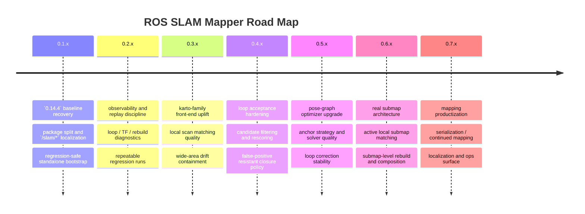

# ROAD MAP

## Product Direction

This project is building toward a standalone SLAM mapping line with:
- a pure mapping-first runtime
- explicit front-end and back-end separation
- conservative loop closure behavior
- enough observability to compare scan matching, keyframe, optimizer, and rebuild changes cleanly
- a long-term architecture that can follow the stronger ideas in `slam_toolbox` without losing the simpler `amr_slam_mapper` baseline

## 0.1.x Goal

- start from `amr_slam_mapper` follow-up quality, not from a blank algorithm experiment
- separate the work from `ros-amr-navigation` contracts and `/amr/*` topic ownership
- establish repository rules around `README.md`, `TODO.md`, `CHANGELOG.rst`, and `coding_template.txt`
- finish stabilizing the localized package split on `/slam/*`
- after `amr_slam_mapper` copy, run-up test after launch and topic-name replacement
- split `slam_mapper` package R&R cleanly

## Immediate Focus

### 1. `0.14.4` Baseline Lock

- keep `amr_slam_mapper` `0.14.4` behavior as the reference line
- allow only:
  - package modularization
  - `/amr/*` to `/slam/*` topic localization
  - bringup / parameter ownership cleanup
- reject accidental algorithm changes before they are explicitly planned
- keep a replayable regression route for:
  - straight corridor
  - one-loop revisit
  - wider left-side excursion

### 2. Observability First

- log and compare:
  - raw odom pose
  - predicted pose
  - corrected pose
  - loop candidate score and accepted edge
  - optimize pre/post displacement
  - rebuild pre/post map retention
- treat runtime noise separately from algorithm issues
- keep enough debug data to explain:
  - loop-triggered `map -> odom` movement
  - rebuild-driven pixel loss
  - wide-area drift accumulation

### 3. Karto-Family Front-End

- front-end is the next major development target
- move toward a more Karto-like local matching mindset before larger back-end surgery
- preserve the good lessons from `amr_slam_mapper`
  - limited IMU heading usage
  - conservative local correction caps
  - rotation-heavy segment handling
- improve:
  - local scan matching robustness
  - scan buffer / local context usage
  - wide-area travel stability before loop closure
- pass criteria
  - straight segments stay stable
  - large turns do not immediately bend the local map
  - wider left-side excursions do not accumulate obvious pre-loop tilt
  - correction jumps remain explainable
- fail criteria
  - front-end becomes harder to reason about
  - straight-line quality regresses
  - loop quality only looks better because false constraints were accepted

### 3A. Phase 1: Matcher Observability

- log and compare for each scan-matching cycle:
  - predicted score
  - coarse-stage best score
  - fine-stage best score
  - final score improvement
  - occupied cell count used by the matcher
  - valid beam count used by the matcher
  - final correction magnitude
  - reject reason when correction is not applied
- pass criteria
  - every accepted or rejected correction is explainable from logs
  - runtime noise can be separated from algorithm failure

### 3B. Phase 2: Coarse-To-Fine Search Policy

- keep the current baseline map source unchanged
- improve only the matcher search strategy
- tune:
  - coarse linear step multiplier
  - coarse angular step multiplier
  - fine window scale
- compare:
  - straight corridor jitter
  - large-turn recovery
  - pre-loop left-side drift
- pass criteria
  - straight corridor corrections become less jittery
  - large-window brute-force behavior is replaced with more stable coarse/fine refinement

### 4. Loop Search And Acceptance

- compare against stronger `slam_toolbox` ideas without copying blindly
- improve:
  - candidate search observability
  - coarse/fine style rescoring
  - conservative acceptance gates
- keep false loop rejection ahead of recall
- pass criteria
  - loop creation does not immediately drag `map -> odom`
  - accepted loop closures improve alignment without pixel wipeout
- fail criteria
  - early but weak loop acceptance
  - prettier maps caused by unsafe loop constraints

### 5. Pose-Graph Optimizer Upgrade

- keep a pose-graph optimizer mindset
  - keyframes
  - odom edges
  - conservative loop edges
  - graph-based correction
- focus on:
  - anchor strategy
  - loop edge weighting
  - step-size stability
  - prior pose pullback behavior
- long-term direction:
  - separate optimizer abstraction
  - evaluate stronger solver options after current limits are proven
- pass criteria
  - loop return aligns better with the original straight axis
  - accepted loop closures do not tip the whole map
  - optimize/rebuild preserves more of the existing map evidence
- fail criteria
  - optimizer tears or over-rotates the map
  - map quality drops after every accepted loop

### 6. Real Submap Architecture

- use submaps as the structural answer to wide-area drift and rebuild quality, not as an early escape hatch
- move here after front-end and optimizer observability are good enough
- target:
  - active local submap based scan matching
  - submap anchor poses
  - submap-level rebuild / composition
  - reduced dependence on one giant temporary map
- pass criteria
  - wider excursions keep local consistency better
  - loop corrections no longer require heavy full-map redraw side effects

### 7. Mapping Productization

- follow selected `slam_toolbox` strengths over time
  - serialization / deserialization
  - continued mapping
  - localization mode
  - richer graph events and operator tooling
- keep the standalone line small enough to understand while adding real production hooks

## Development Order

1. keep the current `0.14.4` baseline stable and measurable
2. improve observability until loop / rebuild failures are fully explainable
3. upgrade the front-end toward a Karto-family local matcher
4. harden loop candidate search and acceptance policy
5. improve the pose-graph optimizer only after front-end quality is clearer
6. introduce real submap architecture when the single-map limits are proven in data
7. add product-level capabilities after the core mapping path is trustworthy

## Experiment Rules

- change one axis at a time
- use the same driving pattern for comparison
  - straight
  - large turn to form loop
  - return to the original corridor or line
  - wider excursion to the left of the origin line
- judge changes by:
  - corrected pose stability
  - map axis preservation
  - loop acceptance timing
  - false loop avoidance
  - rebuild consistency
  - pixel retention after loop-triggered rebuild

## 2026-04-06 Follow-Up

- stop adding standalone-only behavior before the `amr_slam_mapper` `0.14.4` baseline is faithfully localized
- audit the current `ros-slam-mapper` runtime against `ros-amr-navigation/amr_slam_mapper` `humble/develop/0.14.4`
  - identify every intentional and accidental behavior delta
  - especially check loop acceptance, graph rebuild timing, and `map -> odom` handling
- list which parts of the current split are pure package relocation and which parts changed business logic
- revert or realign any post-port additions that were not part of the original `amr_slam_mapper` `0.14.4` behavior
- compare loop-generation timing between the standalone repo and the original AMR line
  - confirm whether the loop is being accepted earlier, more often, or with different correction magnitude
- inspect why straight driving remains stable but the map tilts immediately after loop creation
  - check loop edge construction
  - check optimizer anchor behavior
  - check rebuild pose application order
  - check TF update timing relative to loop acceptance
- prepare a conservative fix list only after the behavior delta from `0.14.4` is clearly documented
- do not implement new front-end or back-end ideas until the baseline mismatch is closed
